# Hackathon Submission: AppwriteHub

## GitHub handle
_Enter your GitHub handle_

@limiter121

## Project Title
_What is the name of your project?_

AppwriteHub

## Project Description    
_What have you built during the hackathon?_

The project I created is a centralized community-driven platform for discovering, deploying, and managing powerful pre-built functionalities (or features) for your Appwrite projects.

- Zero Setup: Deploy features in minutes, not days or weeks
- Community Powered: Leverage the power of the vibrant, global network of Appwrite developers to solve common project needs
- Easy Maintenance: A centralized way to track and apply updates to your deployed functionalities

Behind the scenes AppwriteHub uses the `appwrite` CLI and the `appwrite.config.json` file to push functionalities into a linked project (see `installer` function source code [here](https://github.com/limiter121/AppwriteHub/blob/main/functions/installer/)).

There are many features planned but not finished during Hacktoberfest, such as: auto updating (opt-in with filter: only bugfixes, etc.), import from repository (instead of .zip upload) when publishing a functionality, notifications (push + email), install logs with realtime streaming, etc.

## Inspiration behind the Project  
_What is the story behind this project? Why did you choose to work on this specific idea?_

The reason I chose this idea was because I love Appwrite and wanted a simple solution to add common features (ex. CMS) in my Appwrite projects. Using the Appwrite CLI to push/pull changes to services is great so I built upon that. I like the idea of the Appwrite provided Templates (Functions, Sites) and want a more complete template (to include all services: DB, Functions, Sites, etc.).

## Tech Stack    
_How have you built this project? Mention the technologies/methods/platforms you used to build your project_

The technologies I used are Next.js, Mantine, TailwindCSS, Node.js, Prettier.
Coding was done in VS Code by me with very little help from AI (mainly used Windsurf for autocomplete and Gemini for marketing texts and images).
Everything is running on Appwrite (hub webpage, installer functions, database, etc.) - Built on Appwrite for Appwrite!

### Appwrite products
_Select all the Appwrite products you have used in your project_

- [x] Auth
- [x] Databases
- [x] Storage
- [x] Functions
- [ ] Messaging
- [ ] Realtime
- [x] Sites

## Project Repo  
_Share a public repo link of your project_

https://github.com/limiter121/AppwriteHub

## Deployed Site URL
_Share a `.appwrite.network` URL for your project_

https://hub.appwrite.network

Use `user@example.appwrite` as email and `hacktoberfest2025` as password to access the demo account.

## Demo Video/Photos  
_Share a 2-3 minute demo video of your project_

Homepage:
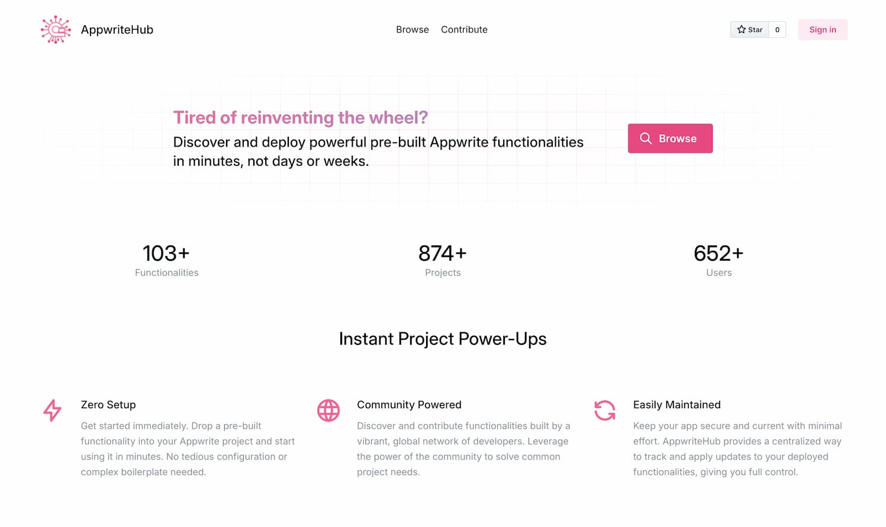

Contribute page:
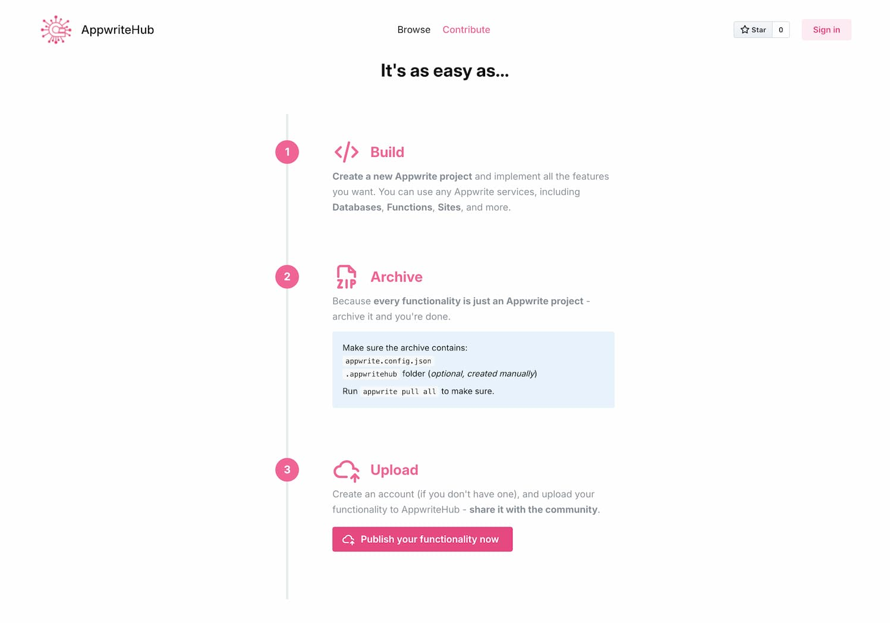

Browse and filter available functionalities:
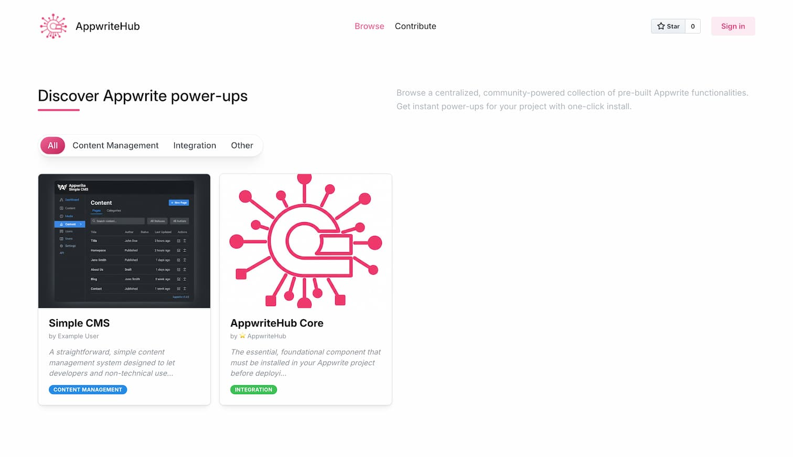

View functionality details (author, description, stats, version history with changelog and contents):
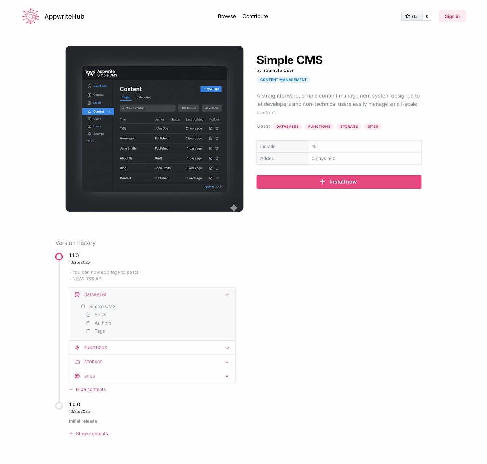

When you press *Install now* on a functionality:
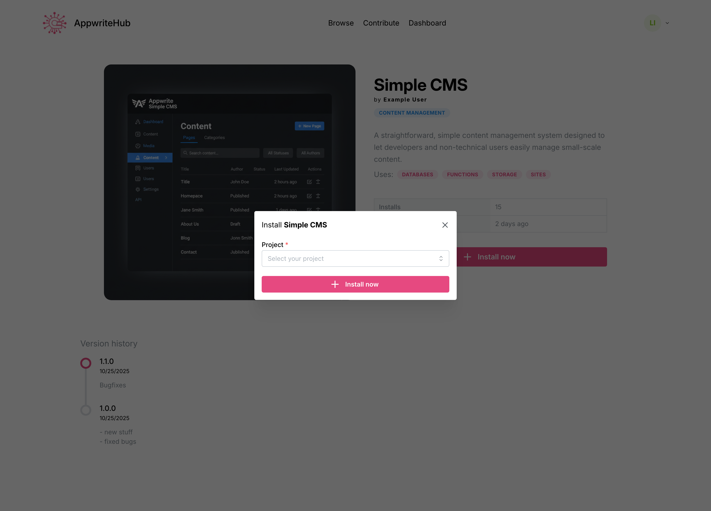

User dashboard - here you can view & link projects, view & publish new functionalities to the hub
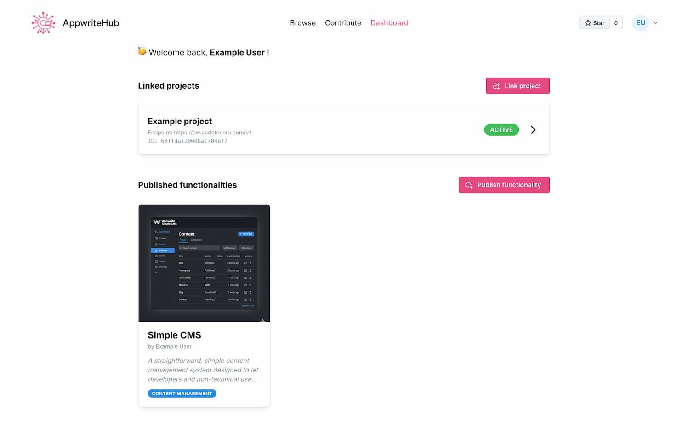

Publish functionality page:
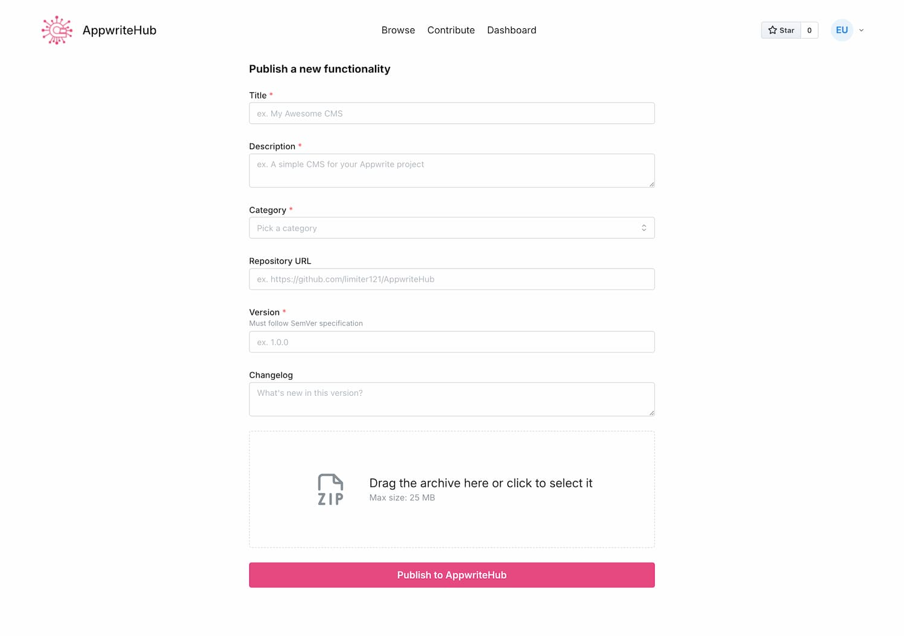

Link project page:
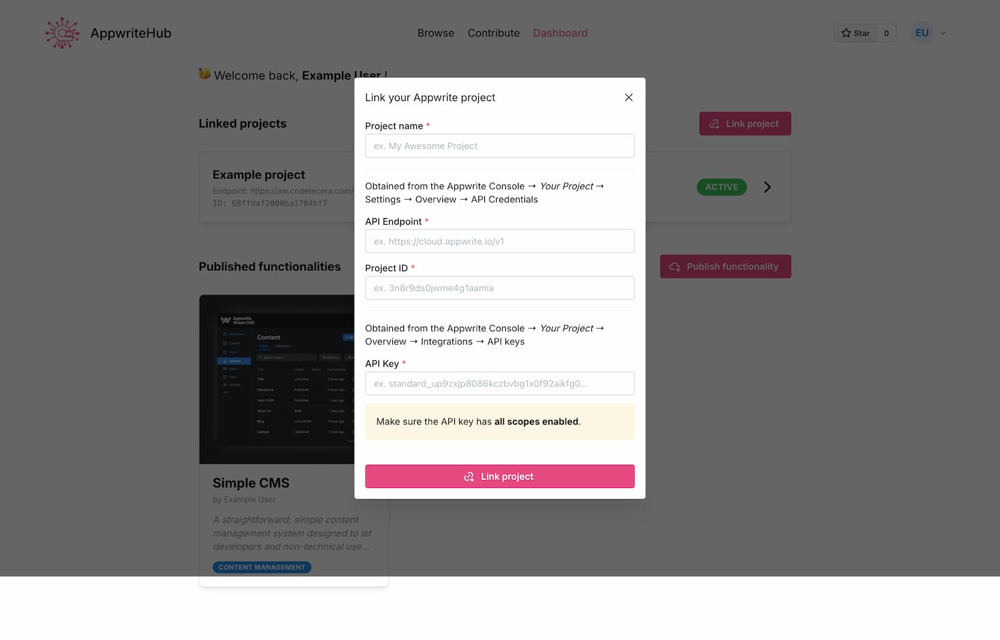

Project linking in progress:
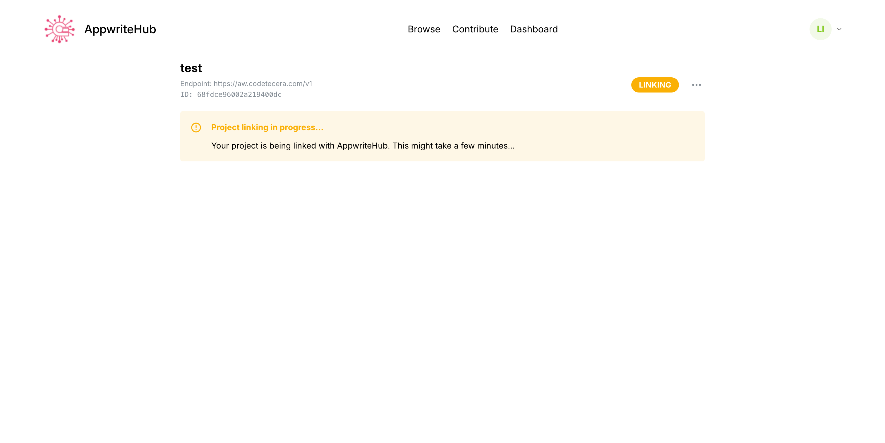

Project linked / active - showing installed functionalities and full history with status (success, fail, pending):
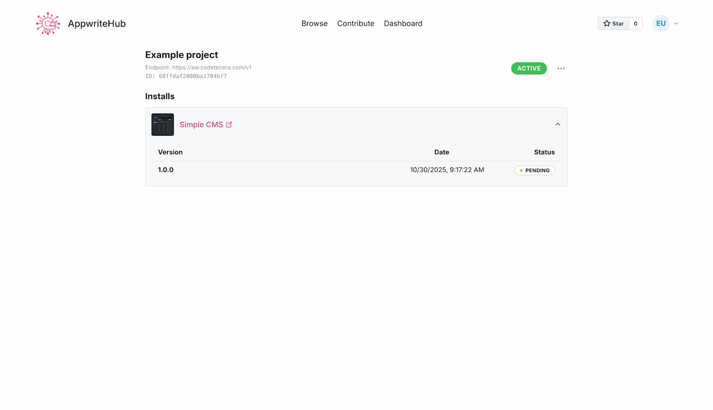

What the "AppwriteHub Core" functionality installed in the example project - a new database with table:
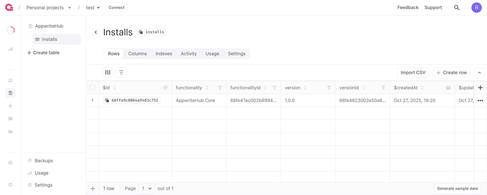

